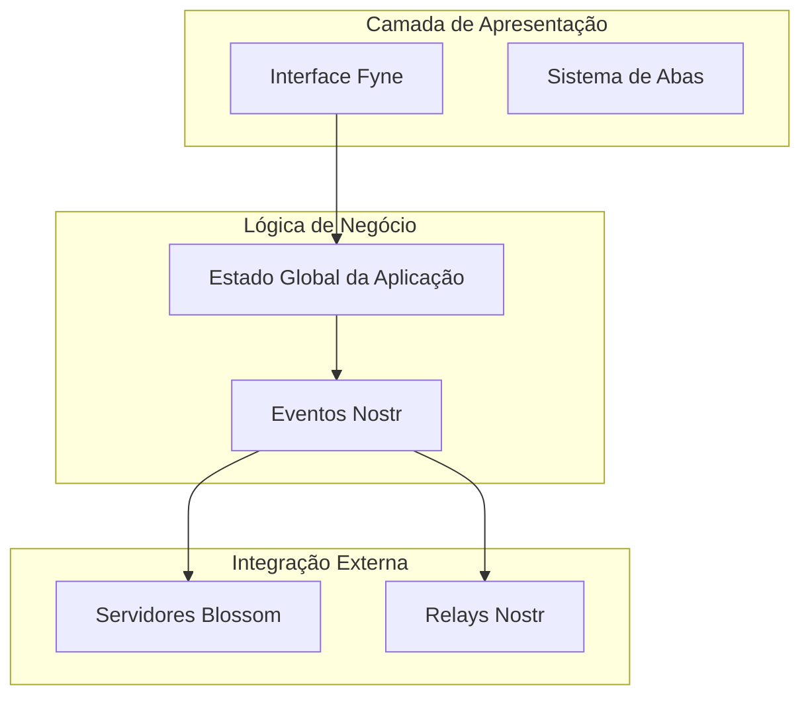

# NostrFilePublisher


[](https://deepwiki.com/gabrielmoura/NostrFilePublisher)

Um cliente desktop GUI para publicação de arquivos na rede Nostr utilizando servidores Blossom como hospedagem
intermediária.

## 📋 Visão Geral

O NostrFilePublisher é uma aplicação desktop multiplataforma construída em Go que permite aos usuários publicar arquivos
na rede descentralizada Nostr. A aplicação implementa um fluxo de trabalho em duas fases: primeiro, os arquivos são
enviados para servidores Blossom centralizados para hospedagem, depois os metadados são publicados em relays Nostr como
eventos estruturados.

## 🚀 Características Principais

### Tipos de Conteúdo Suportados

A aplicação suporte três tipos principais de eventos Nostr para diferentes tipos de conteúdo:

- **Vídeos Curtos (Kind 34235)**: Para conteúdo de vídeo de formato curto
- **Vídeos Longos (Kind 34236)**: Para conteúdo de vídeo de formato longo
- **Arquivos Gerais (Kind 1063)**: Para metadados de arquivo geral

### Interface de Usuário

- **Interface com Abas**: Organizada em quatro seções principais (Principal, Vídeo, Arquivos, Configurações)
- **Bandeja do Sistema**: Integração completa com menu de bandeja do sistema
- **Gerenciamento de Estado**: Estado global thread-safe com `sync.Mutex` para operações concorrentes

### Funcionalidades Avançadas

- **Geração de BlurHash**: Suporte automático para geração de BlurHash a partir de thumbnails
- **Detecção Automática de MIME**: Detecção inteligente de tipos MIME para arquivos
- **Upload Multi-Servidor**: Suporte para upload simultâneo em múltiplos servidores Blossom

## 🏗️ Arquitetura do Sistema

### Componentes Principais



### Estado da Aplicação

A aplicação utiliza uma estrutura centralizada de estado que gerencia configurações globais e dados de runtime

**Componentes do Estado:**

- **HttpClient**: Cliente HTTP reutilizável com timeout de 10 segundos
- **BlossomServers**: Mapeamento de servidores Blossom configurados
- **Relays**: Status de conexão dos relays Nostr
- **Chaves Criptográficas**: Gerenciamento seguro de chaves NSEC/NPUB

## 📦 Instalação

### Pré-requisitos

- Go 1.24.4 ou superior
- Dependências principais:
    - Fyne v2.6.2 para interface gráfica
    - go-nostr v0.52.0 para protocolo Nostr
    - go-blurhash v1.1.1 para geração de BlurHash

### Compilação

```bash
go mod download
go build -o nostr-file-publisher main.go
```

## 🔧 Configuração

### Configuração de Chaves

A aplicação requer configuração de uma chave privada NSEC para assinar eventos

### Gerenciamento de Relays

Interface completa para operações CRUD de relays Nostr com validação de URL WebSocket

### Configuração de Servidores Blossom

Suporte completo para gerenciamento de múltiplos servidores Blossom

## 📤 Fluxo de Publicação

### 1. Seleção e Processamento de Arquivo

- Seleção de arquivo via diálogo nativo
- Cálculo automático de hash SHA-256
- Detecção automática de tipo MIME

### 2. Upload para Blossom

O sistema implementa upload autenticado usando eventos Nostr como tokens de autenticação

### 3. Geração de Evento Nostr

Criação de eventos estruturados com tags padronizadas:

- `url`: URL do arquivo hospedado
- `m`: Tipo MIME
- `x`: Hash SHA-256
- `size`: Tamanho do arquivo
- Tags adicionais para metadados

### 4. Publicação em Relays

Publicação paralela em múltiplos relays com relatório de status individual

## 🔗 Integração com Protocolo Nostr

Esta aplicação implementa funcionalidades baseadas nos seguintes NIPs (Nostr Implementation Possibilities):

- **NIP-01**: Protocolo básico de eventos e relays
- **NIP-19**: Codificação bech32 para chaves e identificadores
- **NIP-94**: Eventos de metadados de arquivo
- **NIP-96**: Protocolo de upload de arquivos HTTP

Para documentação completa dos NIPs, consulte: https://github.com/nostr-protocol/nips

## 🛠️ Utilitários

### Detecção de MIME via URL

Função utilitária para detecção de tipo MIME a partir de URLs remotas

### Sistema de Ícones

Sistema de recursos embutidos para ícones da aplicação

## 🔄 Workflow de Desenvolvimento

O projeto segue uma arquitetura modular com separação clara de responsabilidades:

- **`main.go`**: Ponto de entrada e coordenação da interface
- **`model/`**: Estruturas de dados e estado da aplicação
- **`blossom/`**: Integração com servidores de arquivo
- **`util/`**: Funções utilitárias
- **`icons/`**: Recursos visuais

## 📄 Licença

[Especificar licença do projeto]

## 🤝 Contribuições

Contribuições são bem-vindas! Por favor, consulte as diretrizes de contribuição antes de submeter pull requests.

---

**Notas:**

- Esta aplicação está em conformidade com as especificações do protocolo Nostr
- Requer configuração adequada de relays e servidores Blossom para funcionamento completo
- Suporta operações offline para preparação de conteúdo, com publicação posterior quando conectado

Para mais informações sobre o protocolo Nostr e implementações relacionadas,
visite: https://github.com/nostr-protocol/nips
